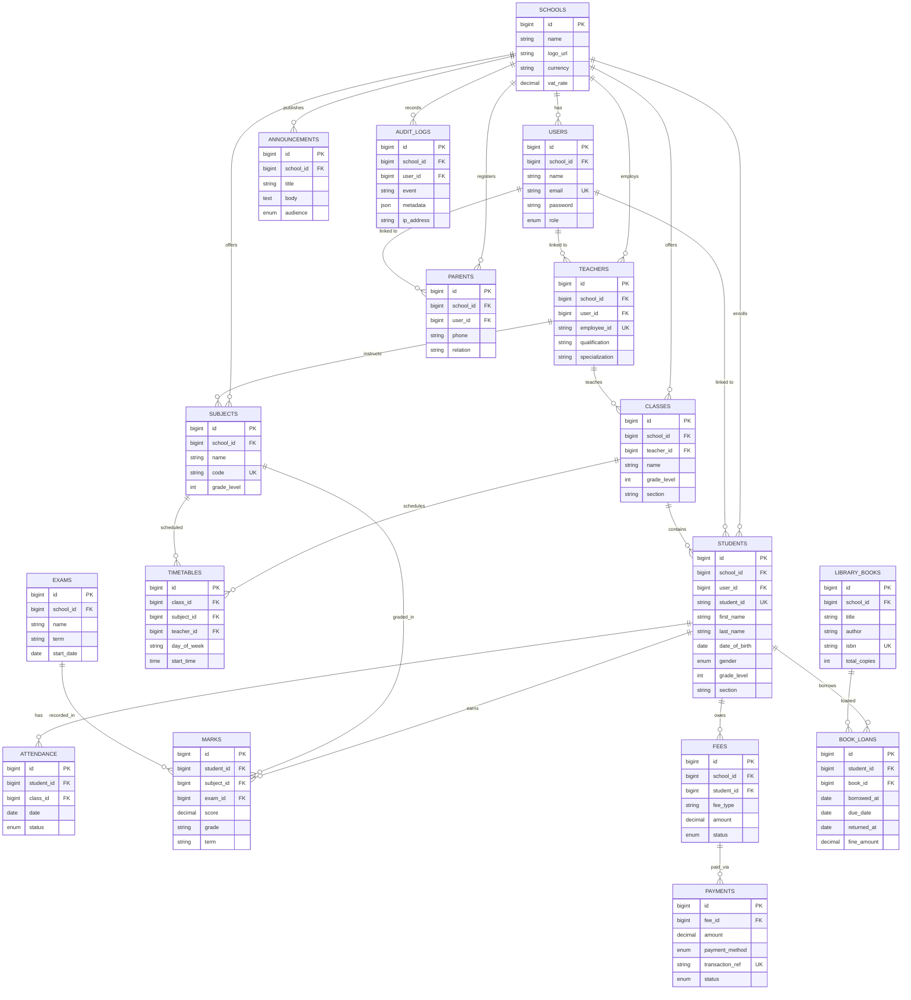

# Software Requirements Specification (SRS)
## Smart School Management System

**Document Version:** 1.0
**Release Date:** October 2026
**Standard Compliance:** IEEE Std 830-1998 / ISO/IEC/IEEE 29148
**Architecture:** Laravel 13 REST API + Vue 3 Single Page Application
**Target Environments:** Private & Public Schools in Ethiopia

---

## Table of Contents

1. [Introduction](#1-introduction)
2. [Overall Description](#2-overall-description)
3. [Specific System & Functional Requirements](#3-specific-system--functional-requirements)
4. [External Interface Requirements](#4-external-interface-requirements)
5. [Non-Functional Requirements (NFRs)](#5-non-functional-requirements-nfrs)
6. [Data Models & Database Schema Overview](#6-data-models--database-schema-overview)
7. [System Verification & Acceptance Criteria](#7-system-verification--acceptance-criteria)

---

## 1. Introduction

### 1.1 Purpose

This document provides a complete, formal, and unambiguous specification of the requirements for the Smart School Management System (SSMS). It is intended for developers, testers, school administrators, and system administrators.

### 1.2 Scope of the System

The system is designed for private and public schools and includes the following:

1. **Student Registration & Management** — Personal data, academic records
2. **Teacher Management** — Profiles, subject assignments
3. **Attendance Tracking** — Daily and period-based
4. **Exam & Grade Management** — Ethiopian grading system (A, B, C, D, F)
5. **Fee Management** — Telebirr, CBE Birr, cash payments
6. **Parent Portal** — Child's grades, attendance, fees
7. **SMS Notifications** — Instant messages to parents
8. **Library Management** — Books, loans, returns, fines
9. **Reports & Analytics** — Enrollment, performance trends

### 1.3 Definitions, Acronyms, and Abbreviations

| Term | Definition |
|------|-----------|
| **SSMS** | Smart School Management System |
| **RBAC** | Role-Based Access Control |
| **SMS** | Short Message Service |
| **GPA** | Grade Point Average |
| **SRS** | Software Requirements Specification |
| **ERD** | Entity Relationship Diagram |
| **API** | Application Programming Interface |
| **JWT** | JSON Web Token |
| **VAT** | Value Added Tax |
| **CRUD** | Create, Read, Update, Delete |
| **UI/UX** | User Interface / User Experience |
| **WCAG** | Web Content Accessibility Guidelines |
| **PDF** | Portable Document Format |
| **CSV** | Comma-Separated Values |
| **REST** | Representational State Transfer |

### 1.4 References

- IEEE Std 830-1998: Recommended Practice for Software Requirements Specifications
- ISO/IEC/IEEE 29148:2018: Systems and software engineering — Life cycle processes — Requirements engineering
- Laravel 13 Documentation: https://laravel.com/docs/13.x
- Vue 3 Documentation: https://vuejs.org
- MySQL 8.4 Documentation: https://dev.mysql.com/doc
- Chapa Payment Gateway API Documentation
- Telebirr API Documentation
- Ethiopian Ministry of Education Curriculum Standards

### 1.5 Document Overview

- **Section 2** — High-level product context, users, and constraints
- **Section 3** — Detailed functional requirements categorized by feature domain
- **Section 4** — Hardware, software, and interface protocols
- **Section 5** — Non-functional quality attributes
- **Section 6** — Data models and schemas
- **Section 7** — Verification acceptance tests

---

## 2. Overall Description

### 2.1 Product Perspective & Context

SSMS operates as a distributed web application. Students, parents, teachers, and administrators interact with responsive, mobile-first web pages. The system provides role-specific dashboards and functionalities.

### 2.2 System Architecture Diagram
+-----------------------------------------------------------------------------------+
|                              CLIENT APPLICATIONS                                   |
|                                                                                    |
|  [Admin Dashboard]  [Teacher Portal]  [Student Portal]  [Parent Portal]            |
+-----------------------------------------------------------------------------------+
                                    │ HTTPS / JSON API
                                    ▼
+-----------------------------------------------------------------------------------+
|                              LARAVEL 13 API GATEWAY                                |
|                                                                                    |
|  [Auth Middleware]  [RBAC Middleware]  [Rate Limiter]  [CORS / CSRF]               |
+-----------------------------------------------------------------------------------+
                                    │
         ┌──────────────────────────┼──────────────────────────┐
         ▼                          ▼                          ▼
+------------------+      +------------------+      +---------------------+
| BUSINESS         |      | BACKGROUND       |      | EXTERNAL SERVICES   |
| SERVICES         |      | WORKERS          |      |                     |
| - Student Mgmt   |      | - SMS Dispatcher |      | - Telebirr Gateway  |
| - Grade Engine   |      | - Email Queue    |      | - CBE Birr Gateway  |
| - Fee Calculator |      | - Report Gen     |      | - AfroMessage SMS   |
| - Attendance     |      | - Backup Job     |      | - SMTP Mailer       |
+------------------+      +------------------+      +---------------------+
         │                          │
         └──────────────────────────┼──────────────────────────┘
                                    ▼
+-----------------------------------------------------------------------------------+
|                          PERSISTENCE & STORAGE LAYER                               |
|                                                                                    |
|   MySQL 8.4 (Tenanted Tables)   │   Redis (Cache / Session / Queues)              |
+-----------------------------------------------------------------------------------+

### 2.3 User Classes & Personas (RBAC Matrix)

| User Role | Access Scope | Key Permissions & Operational Functions |
|-----------|--------------|----------------------------------------|
| **Super Admin** | System-wide | Register schools, manage subscriptions, configure global settings, inspect audit logs |
| **School Admin** | Single School | Configure school profile, manage students, teachers, classes, fees, reports |
| **Director** | Single School | View reports, analytics, approve decisions |
| **Teacher** | Assigned Classes | Enter grades, mark attendance, view class rosters, communicate with parents |
| **Student** | Own Records | View grades, schedule, announcements, library loans |
| **Parent** | Child's Records | View child's progress, pay fees, receive notifications |
| **Accountant** | Fee Module | Record payments, generate receipts, financial reports |
| **Librarian** | Library Module | Manage books, loans, returns, fines |

### 2.4 Operating Environment & Tech Stack

**Backend:**
- PHP 8.3+
- Laravel 13.x
- Laravel Sanctum 4.x
- MySQL 8.0+
- Redis (Cache/Queue)

**Frontend:**
- Vue.js 3.5+
- TypeScript
- Tailwind CSS 4.x
- Pinia (State Management)
- Vue Router
- Vite 8
- Axios

**Third-Party Integrations:**
- Telebirr Payment Gateway
- CBE Birr Payment Gateway
- AfroMessage SMS Gateway
- SMTP Mail Service

**DevOps:**
- Git & GitHub
- Docker (optional)
- Nginx / Apache
- Ubuntu 22.04+ / 24.04 LTS

### 2.5 Design Constraints & Assumptions

1. **Network Connectivity** — Uninterrupted internet for real-time operations
2. **Zero-Friction Guest Access** — Parents must not be blocked by mandatory login
3. **Currency & Tax Localization** — System must support ETB and dynamic VAT
4. **Language Support** — Bilingual interface (English / Amharic)
5. **Data Privacy** — Compliance with Ethiopian data protection laws
6. **Offline Mode** — Not supported in v1.0 (future enhancement)

---

## 3. Specific System & Functional Requirements

### 3.1 User Management & Authentication

- **REQ-1.1** — Users log in via `/api/auth/login` with email and password, returning a Bearer token
- **REQ-1.2** — Passwords hashed using Bcrypt with cost factor ≥ 10
- **REQ-1.3** — Role-checking middleware: `role:admin`, `role:teacher`, `role:student`, `role:parent`
- **REQ-1.4** — Admins can create, update, deactivate user accounts
- **REQ-1.5** — Password reset via email
- **REQ-1.6** — Two-factor authentication (optional, future)

### 3.2 Student Management

- **REQ-2.1** — Register new students with personal + academic information
- **REQ-2.2** — Unique student ID generated per school (e.g., STU-2026-0001)
- **REQ-2.3** — Track student lifecycle: enrolled → active → transferred → graduated
- **REQ-2.4** — Support student transfers in/out with academic records
- **REQ-2.5** — Generate student ID cards (PDF)
- **REQ-2.6** — Bulk import students via Excel/CSV
- **REQ-2.7** — Student profile includes: name, DOB, gender, address, guardian info, photo

### 3.3 Teacher Management

- **REQ-3.1** — Register teachers with qualifications and subject specializations
- **REQ-3.2** — Assign teachers to subjects and classes
- **REQ-3.3** — Track teaching schedules and workload
- **REQ-3.4** — Performance evaluation module
- **REQ-3.5** — Salary information (private schools)

### 3.4 Class & Subject Management

- **REQ-4.1** — Create classes with grade levels, sections, homeroom teachers
- **REQ-4.2** — Define subjects per grade level
- **REQ-4.3** — Assign teachers to subjects
- **REQ-4.4** — Manage class rosters
- **REQ-4.5** — Generate class timetables

### 3.5 Attendance Management

- **REQ-5.1** — Daily attendance tracking for students
- **REQ-5.2** — Period-based attendance (per class)
- **REQ-5.3** — Teacher attendance tracking
- **REQ-5.4** — SMS notifications to parents for absences
- **REQ-5.5** — Monthly attendance reports
- **REQ-5.6** — Attendance status: present, absent, late, excused
- **REQ-5.7** — Bulk attendance marking

### 3.6 Examination & Grade Management

- **REQ-6.1** — Support for various exam types: quiz, midterm, final, assignment
- **REQ-6.2** — Ethiopian grading system: A (90-100), B (80-89), C (70-79), D (60-69), F (<60)
- **REQ-6.3** — Automatic GPA calculation
- **REQ-6.4** — Class rank computation
- **REQ-6.5** — Generate report cards (PDF)
- **REQ-6.6** — Semester and annual results
- **REQ-6.7** — Marks entry by teachers
- **REQ-6.8** — Marks approval workflow
- **REQ-6.9** — Parent portal displays grades

### 3.7 Fee Management

- **REQ-7.1** — Define fee structures per grade level
- **REQ-7.2** — Fee types: tuition, transport, cafeteria, library, uniform
- **REQ-7.3** — Monthly / quarterly / annual payment options
- **REQ-7.4** — Online payment via Telebirr, CBE Birr
- **REQ-7.5** — Cash payment recording
- **REQ-7.6** — Generate receipts (PDF)
- **REQ-7.7** — Automatic SMS reminders for overdue fees
- **REQ-7.8** — Discount management (siblings, scholarships)
- **REQ-7.9** — Outstanding balance reports

### 3.8 Parent Portal

- **REQ-8.1** — Parents log in with phone number
- **REQ-8.2** — View child's grades, attendance, schedule
- **REQ-8.3** — Pay fees online
- **REQ-8.4** — Receive SMS/email notifications
- **REQ-8.5** — Message teachers (optional)
- **REQ-8.6** — View announcements

### 3.9 Communication Module

- **REQ-9.1** — SMS notifications via AfroMessage / Ethio Telecom
- **REQ-9.2** — Email notifications
- **REQ-9.3** — Announcements for specific groups (all, class, section)
- **REQ-9.4** — Bulk SMS sending
- **REQ-9.5** — Message templates

### 3.10 Library Management

- **REQ-10.1** — Book catalog with ISBN, author, category
- **REQ-10.2** — Borrow/return tracking
- **REQ-10.3** — Due date notifications
- **REQ-10.4** — Fine calculation for late returns
- **REQ-10.5** — Search and filter
- **REQ-10.6** — Stock management

### 3.11 Timetable Management

- **REQ-11.1** — Create weekly class schedules
- **REQ-11.2** — Assign periods to subjects and teachers
- **REQ-11.3** — Detect scheduling conflicts
- **REQ-11.4** — Display timetable for students and teachers

### 3.12 Reports & Analytics

- **REQ-12.1** — Enrollment statistics by grade, gender, section
- **REQ-12.2** — Performance trends over time
- **REQ-12.3** — Financial summaries (income, outstanding)
- **REQ-12.4** — Attendance reports
- **REQ-12.5** — Export to Excel/PDF
- **REQ-12.6** — Interactive charts and dashboards

---

## 4. External Interface Requirements

### 4.1 User Interfaces (UI/UX Standards)

- **Design Theme:** Modern, clean, responsive
- **Breakpoints:** Mobile (320px+), Tablet (768px+), Desktop (1920px+)
- **Accessibility:** WCAG 2.1 AA compliant
- **Languages:** English and Amharic
- **Dark Mode:** Supported
- **Touch Targets:** ≥ 44x44px

### 4.2 Hardware Interfaces

- **Printers:** Support for receipt and report card printing (thermal + laser)
- **Scanners:** HTML5 camera API for QR code scanning
- **Biometric:** Fingerprint attendance (optional, future)

### 4.3 Software & Payment Gateway Interfaces

- **Telebirr API:** Mobile money payments
- **CBE Birr API:** Bank payments
- **AfroMessage SMS:** SMS delivery
- **SMTP:** Email delivery

### 4.4 Communication Protocols

- **HTTPS:** TLS 1.2/1.3 mandatory
- **REST API:** Standard HTTP verbs (GET, POST, PUT, PATCH, DELETE)
- **JSON:** Request/response format
- **CORS:** Configured for frontend domain

---

## 5. Non-Functional Requirements (NFRs)

### 5.1 Performance & Throughput

- **API Response Time:** 95% of requests ≤ 200ms
- **Concurrency:** Support 500+ concurrent users
- **Database:** Indexed foreign keys, eager loading to prevent N+1
- **Page Load:** ≤ 2 seconds on 3G

### 5.2 Security & Data Privacy

- **Password Hashing:** Bcrypt (cost ≥ 10)
- **Authentication:** Sanctum tokens with expiration
- **SQL Injection:** Parameterized queries (Eloquent ORM)
- **XSS:** Output escaping
- **CSRF:** Token protection
- **Rate Limiting:** 60 requests/minute per IP
- **HTTPS:** TLS 1.2+
- **Audit Logging:** All sensitive operations

### 5.3 Reliability, Availability & Fault Tolerance

- **Uptime SLA:** 99.5%
- **Database Backups:** Daily automated
- **Database Transactions:** Wrapped in `DB::transaction()` for atomicity
- **Error Logging:** Comprehensive with Sentry integration

### 5.4 Usability & Internationalization

- **Languages:** English + Amharic (i18n)
- **Responsive:** All screen sizes
- **Accessibility:** WCAG 2.1 AA
- **Help:** Contextual tooltips and help text

### 5.5 Maintainability & Scalability

- **Code Style:** PSR-12 (PHP), ESLint (JS)
- **Documentation:** Inline comments + API docs
- **Testing:** Unit + Feature tests (≥ 70% coverage)
- **Modular Architecture:** Separate services, repositories
- **Scalability:** Horizontal scaling supported

---

## 6. Data Models & Database Schema Overview

### 6.1 Database Entity Relationships

#### 6.1.1 High-Level Entity Relationship (ASCII)

```
[schools]
    │
    ├──< [users] (role: admin | teacher | student | parent | accountant | librarian)
    ├──< [students] ──< [attendance]
    │       │
    │       ├──< [marks] ──< [subjects]
    │       ├──< [fees] ──< [payments]
    │       └──< [book_loans] ──< [library_books]
    │
    ├──< [teachers] ──< [subjects]
    ├──< [parents]
    ├──< [classes] ──< [timetables]
    ├──< [exams]
    ├──< [announcements]
    └──< [audit_logs]
```

#### 6.1.2 Complete Entity Relationship Diagram (Mermaid)



#### 6.1.3 Relationship Explanations

| Relationship | Type | Description |
|--------------|------|-------------|
| School → Users | One-to-Many | Each school has many users |
| School → Students | One-to-Many | Each school enrolls many students |
| School → Teachers | One-to-Many | Each school employs many teachers |
| Student → Attendance | One-to-Many | Each student has many attendance records |
| Student → Marks | One-to-Many | Each student earns many marks |
| Student → Fees | One-to-Many | Each student owes many fees |
| Student → Book Loans | One-to-Many | Each student borrows many books |
| Teacher → Classes | One-to-Many | Each teacher teaches many classes |
| Class → Students | One-to-Many | Each class contains many students |
| Subject → Marks | One-to-Many | Each subject has many marks |
| Fee → Payments | One-to-Many | Each fee can have many payments |
| Book → Book Loans | One-to-Many | Each book has many loans |
| Exam → Marks | One-to-Many | Each exam records many marks |
### 6.2 Core Tables (17)

| # | Table | Purpose | Key Fields |
|---|-------|---------|------------|
| 1 | `schools` | School information | name, logo, currency, vat_rate |
| 2 | `users` | All system users | name, email, password, role |
| 3 | `students` | Student records | student_id, name, grade_level, section |
| 4 | `teachers` | Teacher records | employee_id, qualification, specialization |
| 5 | `parents` | Parent/guardian records | phone, relation, occupation |
| 6 | `classes` | Class definitions | name, grade_level, section, capacity |
| 7 | `subjects` | Subject definitions | name, code, grade_level |
| 8 | `attendance` | Attendance records | student_id, date, status |
| 9 | `marks` | Exam marks | student_id, subject_id, score, grade |
| 10 | `fees` | Fee definitions | student_id, fee_type, amount, due_date |
| 11 | `payments` | Payment transactions | fee_id, amount, payment_method, status |
| 12 | `announcements` | Announcements | title, body, audience |
| 13 | `timetables` | Class schedules | class_id, subject_id, day_of_week |
| 14 | `library_books` | Book catalog | title, author, isbn, total_copies |
| 15 | `book_loans` | Book loans | student_id, book_id, due_date |
| 16 | `exams` | Exam definitions | name, term, start_date, end_date |
| 17 | `audit_logs` | System audit trail | event, metadata, ip_address |

### 6.3 Database Indexing Strategy

| Table | Index | Type | Purpose |
|-------|-------|------|---------|
| `users` | `email` | Unique | Login performance |
| `users` | `(school_id, role)` | Composite | Role filtering |
| `students` | `student_id` | Unique | Student lookup |
| `students` | `(school_id, grade_level, section)` | Composite | Class roster |
| `attendance` | `(student_id, date)` | Composite | Daily lookup |
| `marks` | `(student_id, subject_id, term)` | Composite | Report cards |
| `fees` | `(student_id, status)` | Composite | Outstanding fees |
| `payments` | `transaction_ref` | Unique | Payment lookup |
| `library_books` | `isbn` | Unique | Book lookup |
| `book_loans` | `(student_id, status)` | Composite | Active loans |
| `audit_logs` | `(school_id, event)` | Composite | Audit queries |

## 7. System Verification & Acceptance Criteria

| Test ID | Requirement | Verification Method | Acceptance Pass Criteria |
|---------|-------------|---------------------|--------------------------|
| TC-01 | User Authentication | Functional Test | Valid credentials return token; invalid return 401 |
| TC-02 | RBAC | Integration Test | Teacher cannot access admin routes (403) |
| TC-03 | Student Registration | Functional Test | New student creates record with unique ID |
| TC-04 | Attendance | Functional Test | Attendance saved; SMS sent to parent for absence |
| TC-05 | Grade Calculation | Algorithmic Test | GPA calculated correctly per Ethiopian system |
| TC-06 | Fee Payment | Integration Test | Telebirr payment updates fee status to "paid" |
| TC-07 | Report Card PDF | Functional Test | PDF generated with correct grades and school logo |
| TC-08 | SMS Notification | Gateway Simulation | SMS delivered within 30 seconds |
| TC-09 | Excel Export | Functional Test | Excel file contains all expected columns |
| TC-10 | Data Isolation | Security Test | Users from School A cannot access School B data |

---

**© 2026 Smart School Management System. All rights reserved.**
